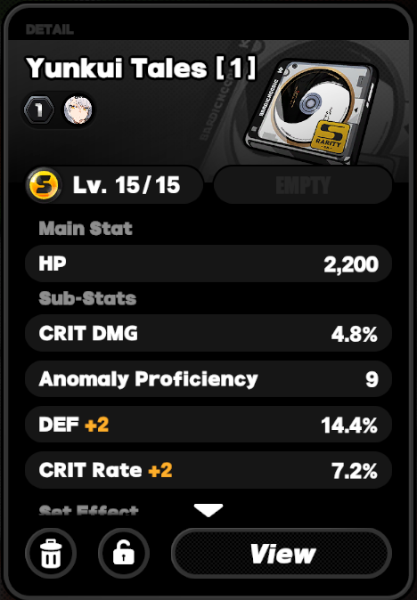
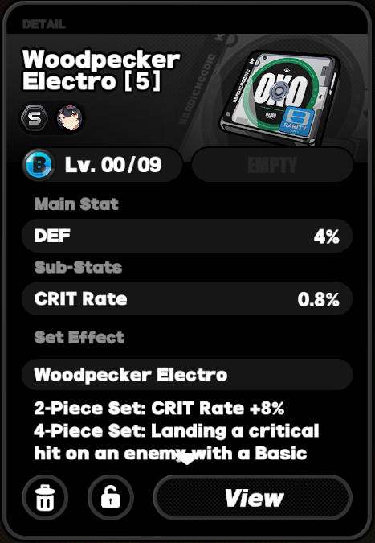

# zzz-item-scanner-nntraining
This is a personal project to self-train a NN (CNN/CRNN) to scan items (*Disk Drives*) in ZZZ

## Rationale
There are other scanners already available, as far as I could tell they rely on PyTerracts OCR to scan lines and use some post-processing script to convert that into objects.

This repository aims to self-train a some form of NN due to the limited scope of the output data as well as being able to synthetically generate training data this should allow for greater accuracy as a Tesseract-Wrapper even with my very limited computing power. For instance I'm training on a single 1660Ti.

Yes, visual transformers outperfrom CNNs broadly speaking albeit on huge data sets. However I want to train my own net and don't have access to "infinite" data and computing power.

## Planning
1. Generate synthetic data to train & evaluate on
    * for limited classes generate examples per classes
2. Choose, train & optimize nets
    * more information on the nets themselves see below
    * should in the foreseeable future
3. (seperate repository) take the results to use in an automatic scanner application
    * with export capabilites to use on i.e. zzz-damage-optimizers 

## Structure of the net(s)
The eventual net can be split into 4 seperate net-components. To see why this is the case consider the following screenshots to see how rigid the data to be evaluated is.

Example S Tier Disk Drive

    

Example B Tier Disk Drive

As you can see in the above examples even though the items are very different each relevant stat can be extracted from the same regions. At the top is the set name on one or two lines, below that is always the level, main stat and sub-stats. The main stat and sub-stats have never been changed, as well as the possible tiers/levels of the items. The sub-stats are slightly more complex to detect because they can be 1 to 4 lines. Notice that after valid sub-stat lines the words "Set Effect" appear. We can use this to train a line-wise classification and later discard lines with and after "Set Effect".

We can easily enumerate over all categories to receive the amount of classes per main stat, sub-stats lines and levels:
* a main stat line = 624 valid permutations
* a sub-stats line = 120 valid permutations + "Set Effect" stop word
* a level line = 39 valid permutations

(see [generate_mappings.py](./generate_mappings.py) for exact information on this calculation)

With these limited amount of possible classes per net a traditional CNN like ResNet-18 should train fast and have high accuracy.

The biggest issue is training on the set name. Since additional sets will be released in the future and they won't just contain English word (comp. first example) a generic OCR or CRNN on the specific font will probably have to be used.